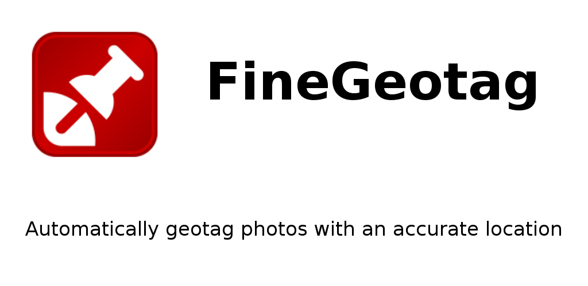
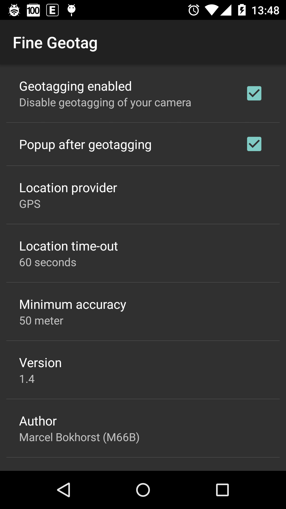

# FineGeotag

Automatically geotag photos with a real-time fine location right after they are taken.

The camera application mostly uses the last known location, which could be old and miles away from your current position.

FineGeotag by default acquires a location in real-time from the GPS receiver
and updates the [Exif](http://en.wikipedia.org/wiki/Exchangeable_image_file_format) location tags of the photo taken.

Optionally a popup will be shown with a thumbnail of the photo and the [reverse geocoded](http://en.wikipedia.org/wiki/Reverse_geocoding) address
(note that the Google geocoder needs to be present for geocoding to work).

Don't forget to disable geotagging of your camera application to prevent interference.

You could use [PhotoMap](https://play.google.com/store/apps/details?id=eu.bischofs.photomap) or similar to display geotagged photos on a map.

Works only for JPEG pictures.

Works on Android 2.3+ (Gingerbread and later).

# Settings

**Location provider**

* *GPS*: most accurate, with altitude information, but doesn't always work indoors
* *Network*: less accurate, no altitude information, mostly works indoors as well
* *Passive*: use locations requested by other applications

**Location time-out**

If no location could be acquire in the specified time, the best last know location will be used.

**Minimum accuracy**

Stop locating after a location with this or a better accuracy has been acquired.

# Permissions

*ACCESS_COARSE/FINE_LOCATION*: to acquire locations for geotagging

*WRITE_EXTERNAL_STORAGE*: to write [Exif](http://en.wikipedia.org/wiki/Exchangeable_image_file_format) location tags to photos

# Privacy

FineGeotag has no INTERNET permission, so you don't have to be afraid privacy sensitive information is going anywhere.

# Download

* [GitHub releases](https://github.com/M66B/FineGeotag/releases)
* [Play store](https://play.google.com/store/apps/details?id=eu.faircode.finegeotag)

# Support

You can [create a GitHub issue](https://github.com/M66B/FineGeotag/issues) for bugs
or use [this XDA forum](http://forum.xda-developers.com/android/apps-games/20150508-fine-geotag-t3103110) for questions.

# Attribution

The application icon is taken from the [Geotag Icon Project](https://geotagicons.wordpress.com/)

# License

[GNU General Public License version 3](http://www.gnu.org/licenses/gpl.txt)

Copyright (c) 2015 [Marcel Bokhorst](http://blog.bokhorst.biz/about/)
([M66B](http://forum.xda-developers.com/member.php?u=2799345))
All rights reserved

This file is part of FineGeotag.

FineGeotag is free software: you can redistribute it and/or modify
it under the terms of the GNU General Public License as published by
the Free Software Foundation, either version 3 of the License, or
(at your discretion) any later version.

FineGeotag is distributed in the hope that it will be useful,
but WITHOUT ANY WARRANTY; without even the implied warranty of
MERCHANTABILITY or FITNESS FOR A PARTICULAR PURPOSE.  See the
GNU General Public License for more details.

You should have received a copy of the GNU General Public License
along with FineGeotag.  If not, see [http://www.gnu.org/licenses/](http://www.gnu.org/licenses/).

