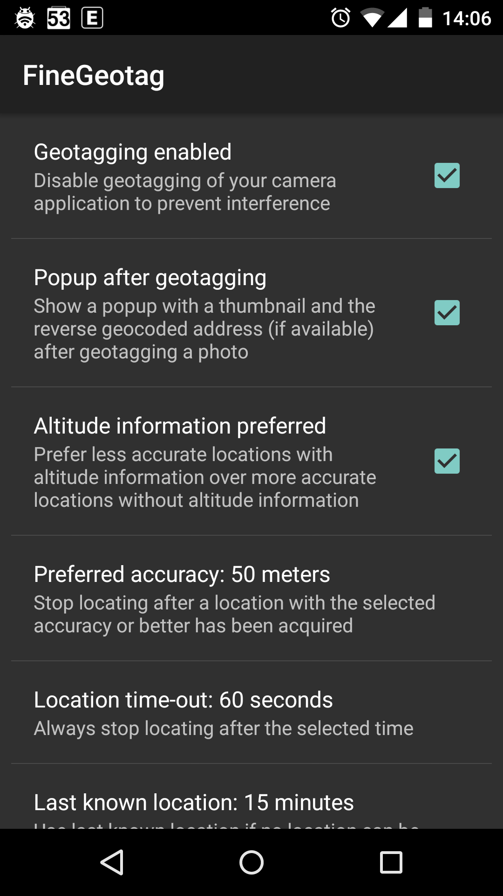

# Fine Geotag
Automatically geotag photos with a real-time fine location right after they were taken.

Don't forget to disable getagging of your camera application to prevent interference.

Works only for JPEG pictures.

# License

[GNU General Public License version 3](http://www.gnu.org/licenses/gpl.txt)

Copyright (c) 2015 [Marcel Bokhorst](http://blog.bokhorst.biz/about/)
([M66B](http://forum.xda-developers.com/member.php?u=2799345))
All rights reserved

This file is part of FineGeotag.

FineGeotag is free software: you can redistribute it and/or modify
it under the terms of the GNU General Public License as published by
the Free Software Foundation, either version 3 of the License, or
(at your discretion) any later version.

FineGeotag is distributed in the hope that it will be useful,
but WITHOUT ANY WARRANTY; without even the implied warranty of
MERCHANTABILITY or FITNESS FOR A PARTICULAR PURPOSE.  See the
GNU General Public License for more details.

You should have received a copy of the GNU General Public License
along with FineGeotag.  If not, see [http://www.gnu.org/licenses/](http://www.gnu.org/licenses/).

